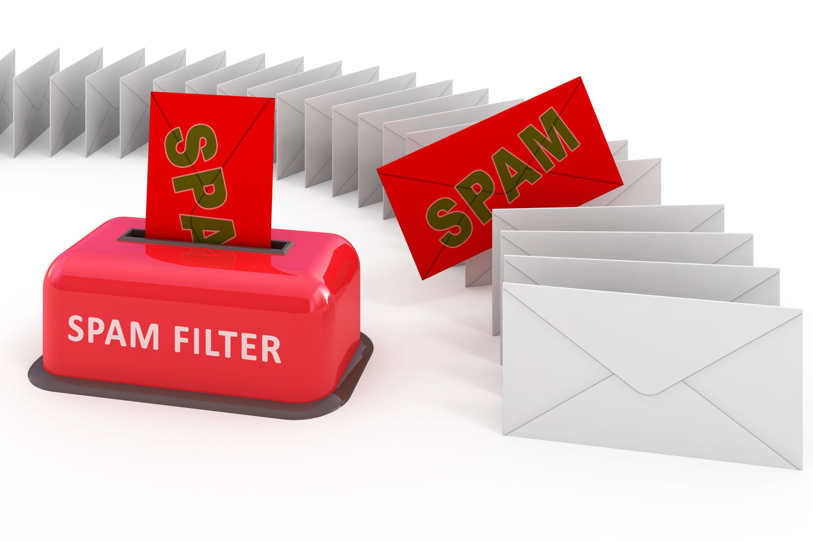

# Identifying spam messages using NLP and deep learning methods

 

<kbd></kbd>

 

# Context

This short project was completed over the course of a week in my spare time with the intetion of building further familiarity with some NLP methods and the Keras/Tensorflow library. To keep things simple I have lifted a pre-made dataset from [kaggle.com](https://www.kaggle.com/datasets/team-ai/spam-text-message-classification), consiting of 5157 text messages. 13% of the messages are labelles as spam, leaving the remaining 87% as 'ham'.

