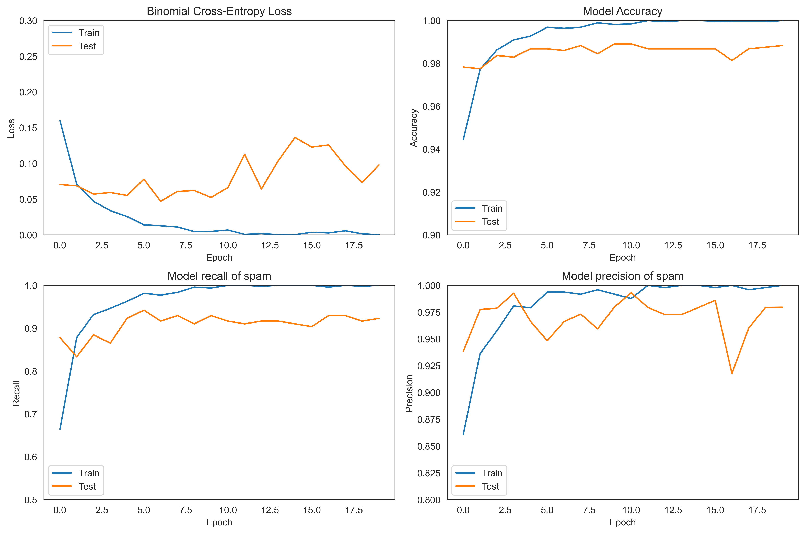
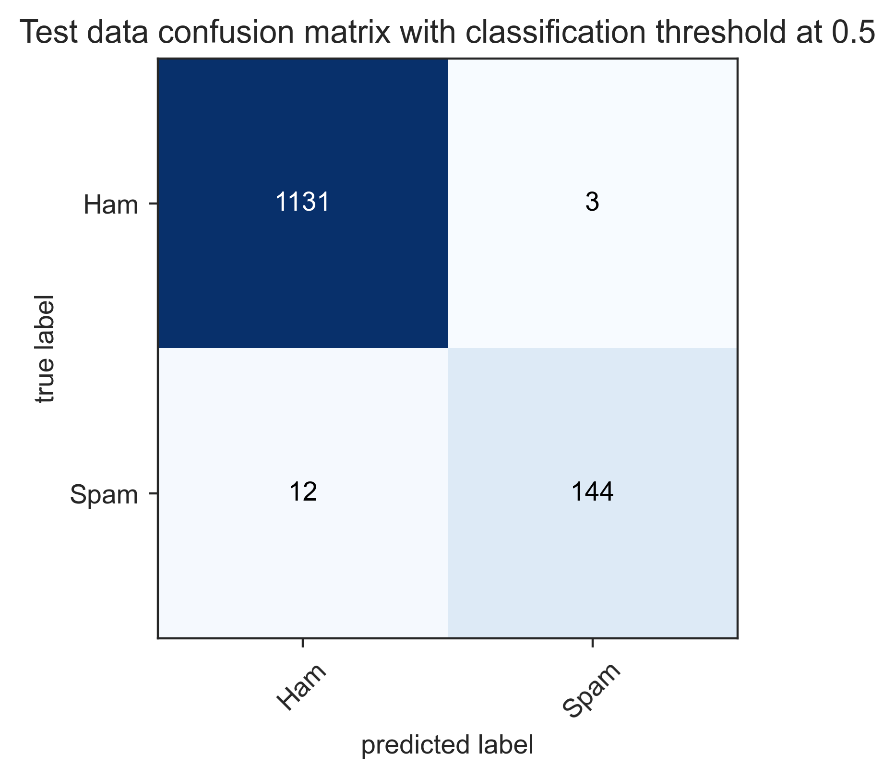
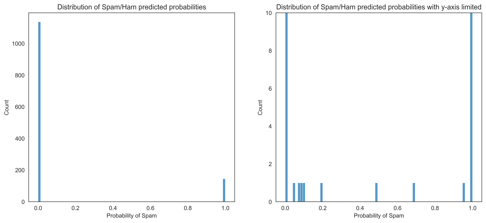
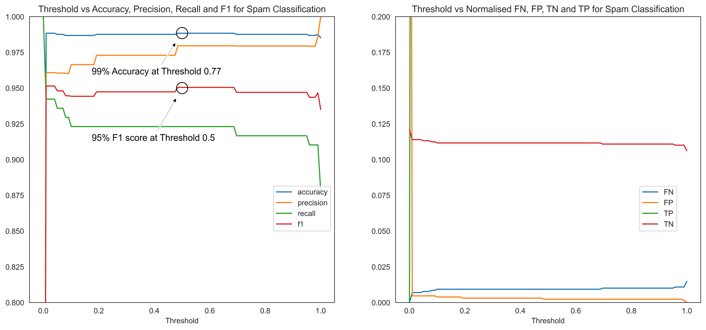

# Identifying Spam Messages using NLP and Deep Learning Methods

<br>
<p align="center" width="100%">
<kbd></kbd>
</p>
<br>

# Context

This short project was completed over the course of a week in my spare time with the intetion of building further familiarity with some NLP methods and the Keras/TensorFlow library. It was entirely self directed and as such will be documented more informally that before. To keep things simple I have lifted a pre-made dataset from [kaggle.com](https://www.kaggle.com/datasets/team-ai/spam-text-message-classification).

The coding can all be found in [this jupyter notebook](https://github.com/rgdavies92/tensorflow-spam/blob/main/spam_detection.ipynb), with details of the environment [here](https://github.com/rgdavies92/tensorflow-spam/blob/main/requirements.txt).

# Table of Contents

- [Spam Statistics](#spam-statistics)<br> 
- [Objectives](#objectives)<br>
- [Input Data](#input-data)<br>
- [Data Cleaning and EDA](#data-cleaning-and-eda)<br> 
- [NLP and Modelling](#nlp-and-modelling)<br>
    - [Tokenize](#tokenize)<br>
    - [Pad](#pad)<br>
    - [Prepare Word Embedding](#prepare-word-embedding)<br>
    - [Train-Test Split](#train-test-split)<br>
    - [RNN Model](#rnn-model)<br>
- [Results](#results)<br>
- [Closing Thoughts](#closing-thoughts)<br>
- [Contact](#contact)<br>


# Spam Statistics

Approximately 22.5 billion legitimate emails are sent over the internet each day and this is only 15% of the total number of emails! Nearly 85% of all emails are spam, meaning **over 122 billion spam emails are sent daily**. 

Of these 122 billion spam emails, the [top three categories](https://dataprot.net/statistics/spam-statistics/) are:

1. 36% of spam emails are advertising 
2. 32% of spam emails contain adult content
3. 27% of spam emails are related to financial matters

Spam emails are sometimes dangerous, often costly and always annoying. Fortunately ML techniques can be used to identify and intercept spam before they reach our inboxes.

# Objectives

The primary objective is to build a deep learning model which can identify messages as spam or 'ham', i.e. not spam. Model performance should be evaluated in terms of accuracy, precision, recall and f1-score for the spam category. 

Although possible, for this problem we have no assumed underlying business case such as *maximise recall of spam emails*.

The secondary objective is simply to learn about new aspects of NLP and TensorFlow.  

# Input Data

To keep things simple I have lifted a pre-made dataset from [kaggle.com](https://www.kaggle.com/datasets/team-ai/spam-text-message-classification), consisting of 5157 unique text messages. 12% of the messages are labelled as spam, leaving the remaining 88% as 'ham'. Although these are specifically text messages rather than emails the content is similar enough for the purposes of this project. 
<br>
<br>

| | Category  | Message |
|-| ------------- | ------------- |
|0| ham  | Go until jurong point, crazy.. Available only in bugis n great world la e buffet... Cine there got amore wat...  |
|1| ham  | Ok lar... Joking wif u oni...  |
|2| spam  | Free entry in 2 a wkly comp to win FA Cup final tkts 21st May 2005. Text FA to 87121 to receive entry question(std txt rate)T&C's apply 08452810075over18's  |
|3| ham  | U dun say so early hor... U c already then say...  |
|4| ham  | Nah I don't think he goes to usf, he lives around here though |
<p align="center"><i><sub><b>Figure 1:</b> Top five rows of the input data.</sub></i></p>
<br>

# Data Cleaning and EDA

Since this is a two column dataset with `Category` and `Message` columns there is really very little data cleaning to do. Removing duplicates in the `Message` column identified 415 duplicated messages which were dropped to leave 5157 unique messages. Punctuation and text case will be standardised later as part of the NLP workflow so for now the cleaning is done. 

<br>
<p align="center" width="100%">
<kbd></kbd>
</p>
<p align="center"><i><sub><b>Figure 2:</b> Left: Distribution plot of message wordcount by spam/ham label. Right: Pie chart illustration of dataset composition by spam/ham label.</sub></i></p>
<br>

The histogram in figure 2 above shows that the median word count for a spam message is around 25 words. Shorter messages around 12 words long are predominantly ham whilst the longest messages are also commonly ham. The distribution plots are nice, but we can also look at some figures to describe the data. 

<br>
<p align="center" width="100%">
<kbd></kbd>
</p>
<p align="center"><i><sub><b>Figure 3:</b> Table of descriptive metrics by spam/ham classification.</sub></i></p>
<br>

The values in figure 3 align with what is observed in figure 2. Finally let's have a look at some word clouds for the different categories.

<br>
<p align="center" width="100%">
<kbd></kbd>
</p>
<p align="center"><i><sub><b>Figure 4:</b> Word clouds for spam messages and ham messages. The largest words are the most frequntly present.</sub></i></p>
<br>

I used the `TfidfVectorizer` class from Scikit-learn to generate these word clouds. This method won't be used later in the modelling, it was just a bit of fun to investigate what sort of words are being used in the spam/ham. There's a sense of urgency in the spam cloud, with more capital letters and more prizes to be won. If I was being paid I'd look into the 'lt' and 'gt' words in the ham word cloud as I have a hunch that these might be associated with text formatting or emojis. 

That concludes this brief interrogation of a very simple dataset. Although I have used word count to describe differences between the spam and the ham, this attribute will not be included in the spam prediction model. Instead I will look to use some NLP methods to generate predictors. 

# NLP and Modelling

Now we get to the learning part for me. My previous NLP experience has been captured [here](https://github.com/rgdavies92/salaries-in-data) in a General Assembly project concerning job salaries in data related roles. The workflow consisted of stemming words, removing stop-words, count-vectorising over n-grams and selecting the top n predictors for input to logistic regression. This worked quite well at the time but I'm going to try a different approach here.

The workflow to be implemented in this spam project consists of the following:
* Tokenize words in the messages to obtain integer vectors where each integer is the index of a token in a dictionary.
* Pad the sequences to ensure all integer vectors have a constant length of 100 integers.
* Use a pre-trained GloVe word embedding dataset in 100 dimensional space to map the tokenized words to the corresponding embedded vector. 
* Enter the GloVe embedded messages as predictors into a Bi-directional Long Short-Term Memory Recurrent Neural Network (BiLSTM RNN 🤯) model.

That's the high level overview of the process. I'll now try to break down each of those steps a little further, including my favourite references.

### Tokenize

The Tokenizer class from TensorFlow has allowed each message to be vectorised by turning it into a sequence of integers where each integer is the index of a token in a dictionary. The length of each tokenized message was equal to the number of words in the message. The default behaviour of Tokenizer is to split on white space and filter all punctuation, tabs and line breaks besides the ' character `(!"#$%&()*+,-./:;<=>?@[\\]^_{|}~\t\n)`, so I didn't have to manually standardise punctuation. Tokenizer also converts all words to lower-case as default, saving me a step in preprocessing. 

### Pad

Messages vary in length and so the tokenized outputs also very in length. This must be standardised before word embedding and can easily be done using the pad_sequences module again from TensorFlow. I have opted to cut all messages to 50 words/tokens in length based on the word count histogram in figure 2 above. Where messages are longer than 50 words, the first 50 words are retained, dropping the 51st onwards. My rationale is that the purpose of any message is usually at the start rather than the end. 

After sifting through documentation detailing what the tokenizer was doing and how it interacted with pad_sequences I found a nice and basic article on [kdnuggets](https://www.kdnuggets.com/2020/03/tensorflow-keras-tokenization-text-data-prep.html) which explains the motions with simple examples. I wish I found this at the start. The messages are now ready to be embedded.

### Prepare Word Embedding

Word embedding is a method by which we can represent words as dense vectors. The traditional bag-of-words models consisting of large sparse vectors can quickly grow to unmanageable dimensions, with very high feature redundancy. There are a number of methods by which we can reduce the dimensionality of these NLP problems and I'm going to use word embedding here.

I use a pre-trained GloVe (Global Vectors) word embedding for this problem - the vector representation for each word has already been learned on a massive corpus of 6B tokens which is more than I could do! More can be read about GloVe [here](https://nlp.stanford.edu/projects/glove/). 

In this project I have opted to map each word to a 100 term vector. The selling point for word embedding is that it maps similar words to similar vectors. Based on the context in which these words are presented GloVe is able to map words to the 100 dimensional vector space in a way which retains information about their usage and relationships. I think of this as adding texture to the predictor dataset where a bag of words model would have very little texture. There are some cool examples of word relationships on the [GloVe site](https://nlp.stanford.edu/projects/glove/). 

[Helpful source of information.](https://machinelearningmastery.com/use-word-embedding-layers-deep-learning-keras/) 

I note that at this stage I have only prepared the word embedding. It is actually implemented as the first stage of the model

### Train-Test Split

The messages are split to a train size of 75% and a test size of 25% for model evaluation. 

### RNN Model

A BiLSTM RNN model was defined using the Sequential class from TensorFlow. Layers are stacked into the model in the order Embedding; 128 BiLSTM units; 0.3 Dropout; Dense Output with sigmoid activation function. It might be heavy reading, but a high level of detail has been included with comments in the  model definition code block below.

```Python
def get_bidirectional_model(tokenizer, lstm_units):
    """
    Constructs the model,
    Embedding vectors => Bi-LSTM => 1 fully-connected output neuron with sigmoid activation
    """
   
   # Get the GloVe embedding vectors
    embedding_matrix = get_embedding_vectors(tokenizer) 
                       # This is a function I've defined earlier to get the (9005,100) embedding matrix
    
    # Define the model sequentially https://machinelearningmastery.com/keras-functional-api-deep-learning
    model = Sequential()
    
    # First, embed the words using loaded GloVe
    model.add(Embedding(input_dim=len(tokenizer.word_index)+1, # In this case, we have 9005 tokens in the index
                        output_dim=100, # Each output word is embedded as a vector of length 100
                        weights=[embedding_matrix],
                        trainable=True, # Allow updating if the word embeddings can be improved. 
                        mask_zero=True, # I'm not interested in the zero values which were padded
                        input_length=50)) # Messages were limited to 50 words based on figure 2
    
    # Add bidirectional long short-term memory units
    model.add(Bidirectional(LSTM(lstm_units, recurrent_dropout=0.2)))
    
    # Add dropout to combat overfitting.
    model.add(Dropout(0.2))
    
    # Add output dense layer with sigmoid for 1/0 classification
    model.add(Dense(1, activation="sigmoid"))
    
    # Compile as rmsprop optimizer and pre defined metrics
    model.compile(optimizer="rmsprop", # A first order, gradient-based optimiser which uses an adaptive learning rate
                  loss="binary_crossentropy", # Equivalent to the log-loss function
                  metrics=[METRICS])

    model.summary()
    return model
    
# Build the bidirectional-model with 128 LSTM units
bimodel = get_bidirectional_model(tokenizer=tokenizer, lstm_units=128)
```

Now some of the links that I found useful in defining this:
* [What is the vanishing gradient problem and what is a LSTM](https://towardsdatascience.com/introduction-to-lstm-units-while-playing-jazz-fa0175b59012#)
* [Understanding why I might want to used a BiLSTM rather than an LSTM](https://arxiv.org/pdf/1801.02143.pdf)
* [Implementing dropout](https://towardsdatascience.com/understanding-and-implementing-dropout-in-tensorflow-and-keras-a8a3a02c1bfa)
* [Recurrent dropout as opposed to standard dropout](https://arxiv.org/pdf/1512.05287.pdf)
* [The binary cross entropy loss function](https://towardsdatascience.com/understanding-binary-cross-entropy-log-loss-a-visual-explanation-a3ac6025181a)
* [The rmsprop optimiser](https://medium.com/analytics-vidhya/a-complete-guide-to-adam-and-rmsprop-optimizer-75f4502d83be)

The only other point I'd like to add to this model definition is why I was compelled to choose a BiLSTM RNN in the first place. There are a few reasons: 
* A RNN has a recurrent connection on the hidden state which allows sequential information to be captured in the input data. This makes it particularly useful for text problems where the sequence is paramount. 
* With training the model through back-propagation RNNs suffer from what is known as the vanishing gradient problem. This means that the RNN would struggle to learn long-range dependencies from the early layers and is often described as a short-term memory problem. To combat this I tried using specialised units in the hidden layers: Long Short-Term Memory units or LSTMs. These LSTMs are able to learn long-range dependencies through a series of gated tensor operations which dictate what information to add or remove from the hidden state at each unit.
* Finally, I moved from LSMTs to BiLSTMs because in the spam problem within which I'm working the preceding text is as important as the succeeding text. Word context is a bi-directional feature. Interestingly I don't think this delivered much model uplift, but the theory is strong so I've retained the BiLSTM units.  

<br>
<p align="center" width="100%">
<kbd></kbd>
</p>
<p align="center"><i><sub><b>Figure 5:</b> Diagrams of the bi-directional implementation of LSTM units and single LSTM unit architecture. Within the LSTM unit, the pink circles are arithmetic operators and the coloured rectangles are the gates in LSTM. Sigma denotes the sigmoid function and tanh denotes the hyperbolic tangent function. Images from Cui, Z., Ke, R., Pu, Z. and Wang, Y., 2018. Deep bidirectional and unidirectional LSTM recurrent neural network for network-wide traffic speed prediction. arXiv preprint arXiv:1801.02143. https://arxiv.org/pdf/1801.02143.pdf</sub></i></p>
<br>

# Stopping the Model

The neural netowrk was trained in batches of 64 samples of 20 epochs. I won't cover what those words mean here, although there's a simple description to be found [here](https://machinelearningmastery.com/difference-between-a-batch-and-an-epoch/).

In training the model I was exposed to TensorBoard for the first time. At the end of each epoch the metrics identified in the `model.compile` call are computed and can be plotted at real-time in TensorBoard before all epochs have finished training. This could be very useful if the model run was long and the user required some feedback. For me the model took less than three minutes so after working out how TensorBoard could be useful I returned to plotting the equivalent metrics with the model history and matplotlib.

<br>
<p align="center" width="100%">
<kbd></kbd>
</p>
<p align="center"><i><sub><b>Figure 6:</b> Plots of a subeset of model performance metrics by epoch on the train and test data.</sub></i></p>
<br>

It can be seen that the binomial cross-entropy (log-loss function) of the test dataset begins to rise after epoch 6 and never falls again below this value. Using model checkpoints within the callbacks parameter for the model I was able to save only the best model in terms of binomial cross-entropy. Code for the callbacks parameter actually included `tensorboard`, `model_checkpoints` and `early_stop` and can be found in the [accompanying jupyter notebook](https://github.com/rgdavies92/tensorflow-spam/blob/main/spam_detection.ipynb).

# Results

I'm going to try to present the model performance in many images and few words.

<br>
<p align="center" width="100%">
<kbd></kbd>&nbsp; &nbsp; &nbsp; &nbsp;<kbd></kbd>
</p>
<p align="center"><i><sub><b>Figure 7:</b> Model performance is summarised by the confusion matrix and classification report from Scikit-learn. Classification stats are with a threshold of 0.5.</sub></i></p>
<br>

The model is performing well, with a 99% accuracy score. This is better than the baseline of 88% so I'm pleased. Within the test dataset, three emails are wrongly identified as spam and 12 emails are wrongly identified as ham. That's 15 errors in 1290 messages.

<br>
<p align="center" width="100%">
<kbd>
</p>
<p align="center"><i><sub><b>Figure 8:</b> Distribution of predicted spam probabilities from the model. These two plots display the same data with a different y-axis scale.</sub></i></p>
<br>

Histograms of predicted spam probabilities show that there are only a handful of messages which the model is uncertain about. We can look to adjust the spam/ham classification threshold to optimise model performance.

<br>
<p align="center" width="100%">
<kbd>
</p>
<p align="center"><i><sub><b>Figure 9:</b> These plots describe the trade-off available between different classification model scoring metrics when varying the spam/ham threshold. The left plot shows that the 0.5 threshold yields the maximum accuracy and f1-score.</sub></i></p>
<br>

With only a small number of messages in the uncertain land between spam and ham, these trade-off plots look very jumpy. I have had to stretch the y-axis on each of these to obtain some sort of informative plot. It can be seen that a threshold of 0.5 actually yields the maximum accuracy and f1-score, although a threshold of 0.01 would yield a maximum recall score near 95%. The optimum threshold should probably be driven by what would be deemed acceptable performance from a business perspective which I don't have in this case. I'll proceed with maximising accuracy and f1-score.

Great stuff. The final model accuracy has increased to 98.8% with an f1-score of 94.7%, a precision score of 98.8% and a recall score of 91.7%. With this, the primary [objectives](#objectives) have been met.

# Closing Thoughts

* The model is good, but it isn't perfect. There is still a reason to check your spam folder occasionally. 

* Why is the model doing what it's doing? I hate presenting a black-box model, but I also want to move on to new things. [In the past I have used permutation importance with packages like ELI5](https://github.com/rgdavies92/used-car-value) to illuminate what a model is doing under the hood. When looking into the problem this time round I came across a package called [SHAP (SHapely Additive exPlanations)](https://github.com/slundberg/shap#deep-learning-example-with-deepexplainer-tensorflowkeras-models) which looks promising although confusing. It's on my reading list.

* I'm a little concerned about how the GloVe embedding will handle 'text speak' where characters were once limited. It might be that this model actually performs better on email spam than text spam. Maybe it's not true that all spam is equal.

* If the BiLSTM model pays heeds to preceding and succeeding context, then might it be important to retain some of the punctuation through tokenization? Punctuation is instrumental in providing context and so might be beneficial with this BiLSTM RNN model. I'll be sure to test this if I'm ever working on something like this in a production scenario.

* I've learned a lot on the way:
    * Making word clouds into custom shapes was new      
    * NLP within TensorFlow was new 
    * Word embedding was new
    * Although I had used ANNs before, RNNs, LSTMs and BiLSTMs were all new concepts
    * TensorBoard was new

# Contact

If you found this project interesting or would like to reach out, you can find me on [LinkedIn](https://www.linkedin.com/in/rgdavies92/).
